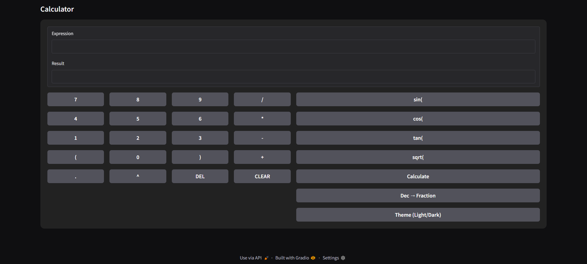

# Calculator-Gradio
Python, Gradio UI

## Key Features
- Full keyboard (numbers, operators, parentheses, delete, clear)
- Trigonometry: sin(), cos(), tan(), sqrt()
- Arithmetic operations
- Evaluation of long expressions such as 3/10 * 2 + sqrt(9)
- Decimal to fraction conversion
- Light & Dark theme switch (Trial)
- Use Gradio for Dashboard / UI

📸 Dashboard:

